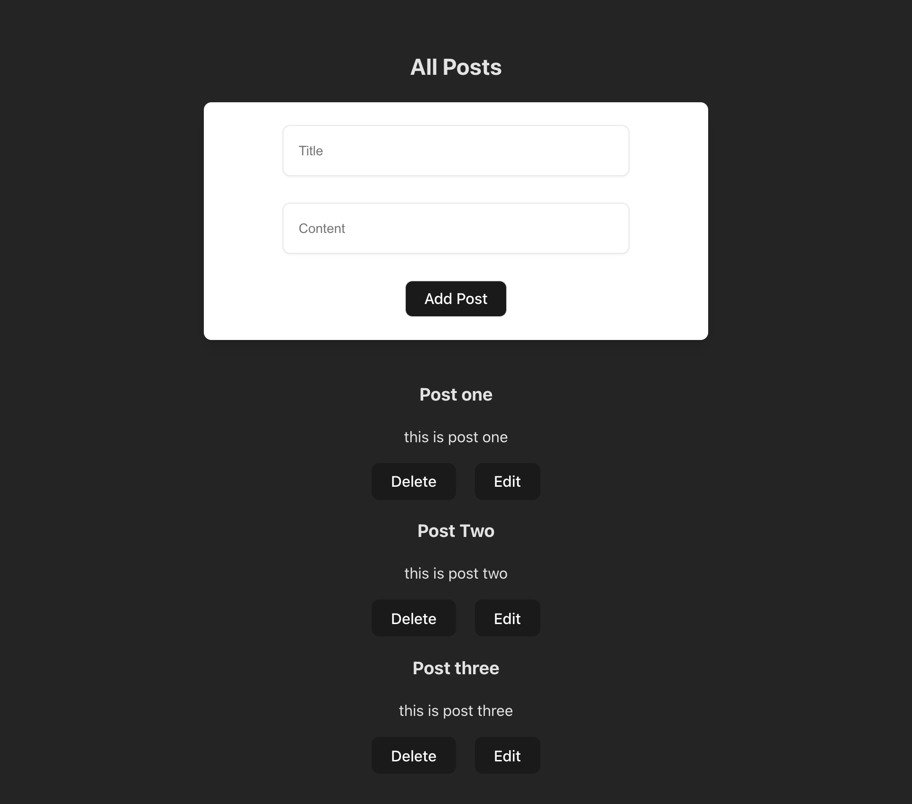

# CRUD-App using React + RTK-Query

## Steps to run the app
1) Download the repo
2) Open in vscode
3) run the "npm i"
4) to start the json-server "npx json-server ./src/assets/db.json" 
5) to start the app "npm run dev"

.png "This is a sample image")
